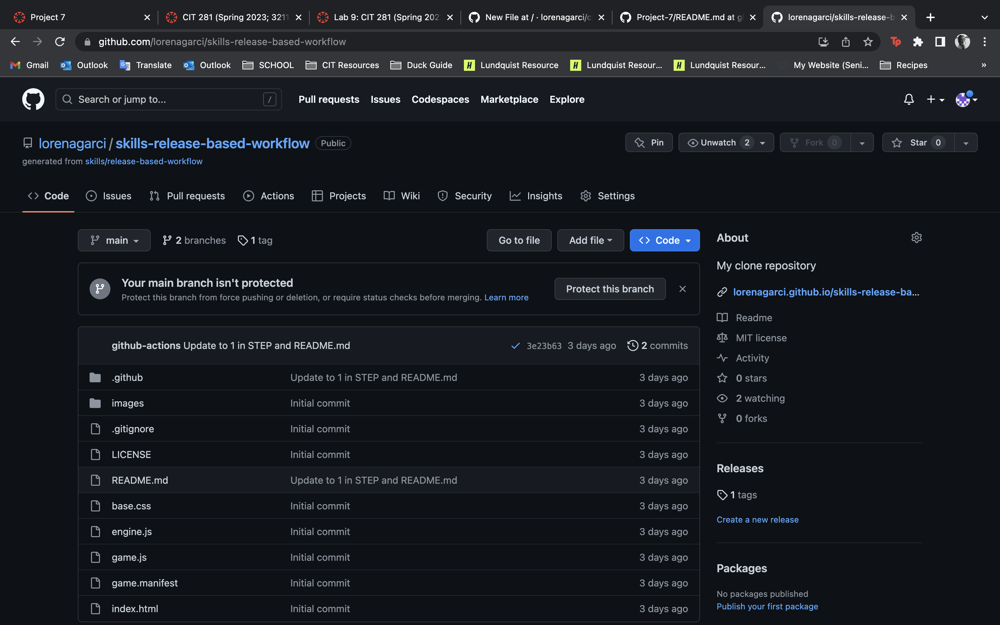

In this lab I used the GitHub Learning Lab and completed a course titled "Create a release-based workflow." which is a course designed to provide me with a hands-on learning opportunity to enhance my understanding of release-based workflows on GitHub.

The core of the lab involved working through the course itself and following the provided steps and instructions to learn about and apply the concepts related to creating a release-based workflow on GitHub.

